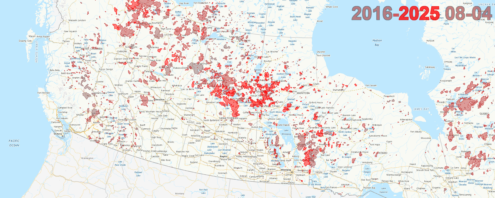

Canadian wildfires feel like they've been getting worse, but I wanted to see the data to help me visualize it. 

I found that the Canadian government has a website with an interactive map that can show wildfire perimeters for a given day and has data back to 2003 ([link](https://cwfis.cfs.nrcan.gc.ca/interactive-map?zoom=3&center=-489719.35496475064%2C659612.9289316565&month=8&day=4&year=2025#iMap), you need to select "Overlays" and remove the "Fire Danger" and choose "Fire Perimeter Estimate" to see what was actually on fire).

It only shows data for a specific day in history, and there's no easy way to compare how things have changed over time.

I threw together a quick python script (`wildfire`) to download and cache the data from the website.  It leverages a `uv` shebang to be self contained.

It can download and cache map tiles and fire perimeter polygons from the Natural Resources Canada website, as well as composite images of what things looked like on a specific day across many years.

ex:

```bash
./wildfire "2025-08-04" 
```

Creates this image showing fire perimeters on August 4th, 2025:


If you give it a second date parameter, it will create composite images that includes fire perimeter data for all years between the two values.  So this:
```bash
./wildfire "2016-08-04" "2025-08-04"
```

Will create a single image with the 10 years of fire perimeter data for August 4th in 2016 through 2025.  Older fire data is more "grey" than newer fire data, which is more "red".



We can compare that to data from the decade starting in 2003 (the first year perimeter data is available) to 2012 with:

```bash
./wildfire "2003-08-04" "2012-08-04"
```


And a full composite image of the last 22 years of fire perimeter data for August 4th:

```bash
./wildfire "2003-08-04" "2025-08-04"
```


### Images for multiple days

If we give it a start date month-day that is prior to the end date month-day, it will create a composite image for every month-day.  So:

```bash
./wildfire "2016-08-01" "2025-08-04"
```

Would create images showing 2016-2025 data for August 1st, 2nd, 3rd, and 4th.

I've leveraged that to create some quick .mp4 animations using `ffmpeg` with this command:

```
ffmpeg -framerate 3 -pattern_type glob -i "wildfire-*.png" \
    -c:v libx264 -pix_fmt yuv420p -crf 23 \
    "../$(basename "$PWD")-wildfires.mp4"
```

This created the following mp4s that show how wildfires have evolved over time. The earliest perimeter data on the website is from 2003.  

Here's the 2003-2012 decade of wildfire starting on April 1st:

https://github.com/user-attachments/assets/a59f341e-9059-4ba2-b197-f33d29cfa61f

Compare that to the last decade of wildfires, 2016-2025:

https://github.com/user-attachments/assets/5f3bd31b-c505-4d4c-9e6e-537e1109ac93


(This was created on August 5th, 2025, so you can see the 2025 data drop off)

And here's the last 22 years of Canadian wildfires in a single animation:

https://github.com/user-attachments/assets/54f7afe6-6a89-4bc7-8aa2-721b5bdcad76
